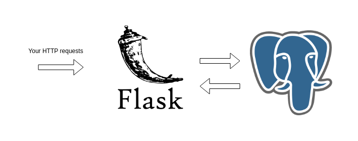
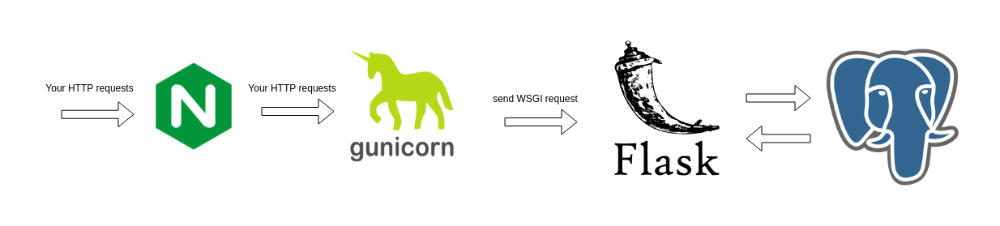

# User Crud Project

This project was made with Flask + SQLAlchemy to Create, Read, Update and Delete users from a database.
The user here is a company, with billing, bank accounts and much more in the future.

# Project Structure

```
config/
├─ # Flask related values
requirements/
├─ # Add any new python dependency here to be installed
src/
├─ __init__.py  # The application Factory
├─ database/
│  ├─ # Database related code
├─ blueprints/
│  ├─ # Add any new blueprints here/
├─ tests/
│  ├─ # Add tests preserving the same path of the original code

```

## Development Overview


Pretty straightforward, the default development server is used to process requests.

## Production Overview


We can't use the Flask development server in Production, so we need to use a WSGI compatible
http server. 

The server chosen for this project was [GUnicorn](https://gunicorn.org/).

Flask is WSGI compatible, this means that, per [PEP 333 (3)](https://peps.python.org/pep-3333/),
Flask exposes a method that receives a HTTP request and a callback. Gunicord transforms the HTTP
request into a dictionary, and this is how Flask will create the `request` global object we can access
in our views.

The reverse proxy, [NGINX](https://www.nginx.com/), is better at handling multiple connections, 
buffering, TLS, and many other things, while the WSGI server only handles making the incoming http
request into something that Flask can understand. So a reverse proxy is placed in front of the WSGI server. 

## Configuring Flask

All three environments, **production**, **local** and **test** have their own configuration files.
```
config/
├─ local.py
├─ production.py
├─ test.py
```
To change a Flask setting, change the setting on the file of the environment. [Flask configuration reference.](https://flask.palletsprojects.com/en/2.2.x/config/)

## Code

### Blueprints

This project uses [Blueprints](https://flask.palletsprojects.com/en/2.2.x/tutorial/views/) to organize it's related code
into modules.

In order to  create new functionality and extend this project, like adding authentication, an authentication blueprint may be created, and so on.

#### company

Holds the views to perform CRUD operations with the models.

### Database

The database module declares the models and has the code to start the database session that is
managed by [Flask-SQLAlchemy extension](https://flask-sqlalchemy.palletsprojects.com/en/2.x/).

The `SaveMixin` makes so that saving and deleting a Model instance can be done with `model.save()` and `model.delete()`.

Example:
```python
from src.database.models import ClientCompany

_instance = ClientCompany() # Model in memory
_instance.save()   # Creates model in database
_instance.delete()  # Deletes model from database
```

# Running

## Development

`docker-compose up -d`

The file containing the application and all other container dependencies is already called 
`docker-compose.yml`, so nothing different from running any other compose.

## Production

`docker-compose -f production.yml up -d`

~~Note to Bhub: TLS and certificates are not configured, but the NGINX is forwading requests.~~

## Tests

To run a tests, first open a bash instance on your container by calling `./bash.sh` on the root of
this project.

To run a specific test:
```
py.test src/tests/path.py
```

to run all tests
```
py.test ./
```